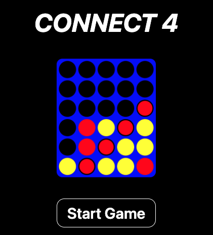

# Connect 4 Game 🎮

A classic **Connect 4** game built using **React Native** and deployed on **GitHub Pages**. Enjoy a two-player mode where you can challenge friends and family to this timeless strategy game!

  

---

## 🌟 Features

- 🎮 **Two-Player Mode**: Play against a friend on the same device.  
- 🕹️ **Interactive Gameplay**: Tap to drop pieces, with turn-based indicators.  
- 🎨 **Responsive UI**: Adapts seamlessly across screen sizes and devices.  
- 🏆 **Winner Detection**: Automatically detects a win or draw and highlights the winning sequence.  
- ↩️ **Undo Moves**: Step back in time with the undo feature, allowing players to reverse their last move and rethink their strategy.

---

## 🛠️ Tech Stack

- **React Native**: Core framework for building the app.  
- **GitHub Pages**: Hosting for the web version of the game.  
- **Expo**: Simplified development and deployment.  

---

## 🚀 Deployment

The game is live on GitHub Pages: [Play Connect 4](https://mohapeameya.github.io/connect-4/)  

---

## 🪩 How to Run Locally

### Prerequisites
- [Node.js](https://nodejs.org/)  
- [Expo CLI](https://expo.dev/)  

### Steps
1. Clone the repository:
   ```bash
   git clone https://github.com/mohapeameya/connect-4.git
   ```
2. Navigate to the project directory:
   ```bash
   cd connect-4
   ```
3. Install dependencies:
   ```bash
   npm install
   ```
4. Start the development server:
   ```bash
   expo start
   ```
5. Open the app on your device using the Expo Go app or a web browser.

---

## 🖼️ Screenshots

<p align="center">
  
  <!--  -->
</p>
<!-- 
<p align="center">
  
  
</p>
<p align="center">
  
</p> -->

---

## 🤝 Contributing

Contributions, issues, and feature requests are welcome!  
Feel free to check the [issues page](https://github.com/mohapeameya/connect-4/issues).  

---

## 📜 License

This project is licensed under the **MIT License**.  
See the [LICENSE](LICENSE) file for details.  

---

## 🙌 Acknowledgements

- Inspired by the classic **Connect 4** board game.  
- Thanks to the **React Native** and **Expo** communities for their awesome tools and resources.  
